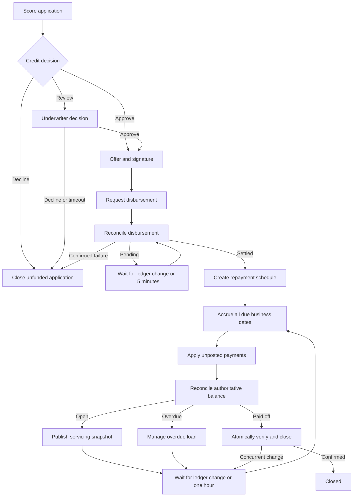

# Loan origination and servicing

The [loan definition](../../examples/definitions/business/loan_lifecycle.yaml)
models application scoring, manual underwriting, offer acceptance, signing,
disbursement confirmation, schedule creation, daily accrual, payment posting,
overdue servicing, and closure. Read the
[shared integration contract](README.md#shared-integration-contract) first.

This is an orchestration example. It does not implement an accounting ledger,
credit policy, jurisdictional rules, or a payment provider. Rates, allocation
priority, rounding, day-count conventions, fees, calendars, and reporting must
come from the versioned product contract and the owning financial system.
The runnable demo uses simulated handler responses and no real currency.

## Lifecycle



This diagram condenses form waits and their timeout routes; the YAML is the full
executable definition. All Gateway and inline branches use ordered XOR routing.
There is no parallel split or implicit child-process execution.

## Startup and authoritative data

Example typed startup body for `/fluxpro/process/loan_lifecycle/start`:

```json
{
  "process_id": "loan_application_1001",
  "version": "1.0.0",
  "context": {
    "loan_id": { "string": "loan_1001" },
    "currency": { "string": "DEMO" },
    "principal_minor": { "number": 100000 }
  }
}
```

These values are illustrative. A real application validates its input and stores
an immutable product/offer version, borrower reference, authorized principal,
currency, calendar, and contract reference in the domain database. Engine context
holds references and routing snapshots; it is not the ledger or the contractual
source of truth. Never allow a caller to overwrite settlement or balance flags.

| Handler | Contract and required outputs |
| --- | --- |
| `score_application` | Persist the decision and policy/model version; string `credit_decision`: `approve`, `review`, or `decline`. Invalid/missing decisions are errors, not invented approvals. |
| `prepare_loan_offer` | Persist authorized terms and an offer version for the borrower form. |
| `verify_loan_signature` | Verify identity, contract version, signature and expiry. Return success only for the authorized signed offer. |
| `request_loan_disbursement` | Durably submit or find the existing authorized disbursement; reuse the same loan/disbursement key on replay. Success here means submission, not paid funds. |
| `reconcile_disbursement` | Read provider and ledger; string `funding_status`: `pending`, `settled`, or conclusively `failed`. A timeout or unknown response is not `failed`. |
| `create_repayment_schedule` | Persist a versioned schedule from actual settlement date and agreed terms; repeated calls return the same schedule. |
| `accrue_due_business_dates` | Process all unposted due dates through the current permitted cutoff, preserving a durable cursor. |
| `apply_unposted_payments` | Read the payment inbox and post each distinct transaction once, with its authoritative value date. |
| `reconcile_loan_balance` | Refresh both Booleans `loan_paid_off` and `loan_overdue` from the ledger on every call. |
| `manage_overdue_loan` | Create/update the existing servicing case; deduplicate reminders by policy period. It does not stop accrual or payment reconciliation. |
| `publish_servicing_snapshot` | Publish a versioned external state; reject writes older than the current domain/engine revision. |
| `close_settled_loan` | Recheck all closure conditions in a ledger transaction; Boolean `closure_confirmed`. A changed balance returns false and resumes servicing. |
| `close_unfunded_application` | Confirm there is no settled or uncertain disbursement before marking the application declined. |

The underwriter's `review_approved` signal must reference a persisted authorized
decision. Approval signals are not a replacement for access control. Likewise,
`verify_loan_signature` is a verification command, not a trust in `signed` text.
Handler failures without an `on_error` route retain an incident for recovery;
they do not automatically become credit declines or successful closure.

## Schedule and daily accrual

The schedule handler owns due dates, period amounts, currency precision, product
version, and schedule version. The external ledger must prevent another schedule
from being created on replay. If schedule creation fails after funds settle, the
instance remains recoverable; retry must not disburse the loan again.

The servicing timer is `PT1H` and deliberately only wakes reconciliation. It does
not mean “charge one hour of interest,” nor does it guarantee execution at midnight.
At every `accrue` visit the handler:

1. Reads the loan's business timezone/calendar and durable accrual cursor.
2. Determines every date eligible for posting under the contract cutoff.
3. Serializes ledger changes for that loan and posts each missing date using a
   unique `(loan_id, business_date, calculation_version)` identity.
4. Advances the cursor atomically with the corresponding postings.
5. Returns only after the durable boundary has succeeded.

After two days of engine downtime, reconciliation covers both missing dates.
Repeated timer ticks on the same business date create no extra charge. The
monotonic cursor must not be advanced before postings commit. Revised calculations
use explicit adjustment entries and calculation versions rather than silently
rewriting journal history.

The YAML's sequential calls are not a transaction across ledger handlers. Each
handler must enforce its own transactional invariants and coordinate with other
ledger writers. If one handler fails after another commits, replay is expected
and must be harmless under the domain keys above.

## Payment ingestion and accounting order

A provider webhook first enters a durable payment inbox under the provider and
transaction ID. Verify its authenticity and store the original provider identity;
then emit `ledger_changed` as a wake-up. Two callbacks for one transaction are one
payment, even if they generate several wake-ups. Two different payments are two
postings, even if one wake-up covers both.

`apply_unposted_payments` reads the inbox, not the signal payload. It handles
partial payment, scheduled payment, and full repayment according to the product
allocation rules and writes a durable receipt with the journal entries. Persist
allocation and inbox consumption atomically. A missing wake-up is recovered by
the hourly reconciliation loop. Incoming facts remain in the inbox while the
process is in an unrelated node or temporarily suspended.

The graph calls accrual before payments, but **queue order is not economic value
date order**. An earlier-valued payment discovered later can change already
calculated accrual. The ledger must serialize dated events and either replay the
relevant calculation interval with explicit adjustments or apply its supported
value-date correction method. A naive implementation that adds interest and then
subtracts all payments will not satisfy this contract.

Reversals, chargebacks, overpayments, backdated adjustments, and corrections after
closure remain ledger obligations. They require explicit domain policies and,
where needed, additional correction workflows. This sample does not implement
those financial calculations or claim those cases are tested end to end.

## Safe closure and external status

`loan_paid_off` routes to the closure command but does not itself close the loan.
The closure transaction rechecks balance, pending postings, disbursement state,
and other product obligations at the same ledger revision. It atomically closes
or returns `closure_confirmed=false`. New postings arriving after closure must
follow the ledger's correction/reopening policy; End cannot consume them.

External status writes need revision fencing even with one active engine worker.
A network request can complete after its worker loses its lease, and a resumed
attempt can repeat a request. Use both stable operation receipts and domain
version checks. Engine stage `closed` is assigned only after the closure command
confirms completion. A production `on_stage_change` hook must preserve that order
when mirroring stages into application tables.

## Executable evidence and its limits

| Scenario | Verified orchestration |
| --- | --- |
| `loan_repaid` | Approval, signature, settled funding, schedule, servicing, duplicate wake-up, and confirmed closure |
| `loan_manual_review_overdue_and_closure_recheck` | Manual approval, pending funding, timeout reconciliation, repeated accrual/payment visits, overdue branch, and rejected first closure attempt |
| `loan_scoring_declined` | Decline ends without funding or servicing |
| `loan_offer_expired` | Offer timeout declines without funding |
| `loan_funding_failed` | Confirmed funding failure never creates a repayment schedule |

The second scenario supplies simulated accrual cursors covering missed dates.
It proves the engine revisits the accrual/payment handlers in the expected order;
it does **not** test date catch-up arithmetic, interest accuracy, payment allocation,
or ledger uniqueness. Those need tests in the real ledger implementation, covering
duplicate provider delivery, a crash after posting, multiple overdue dates, late
value dates, simultaneous postings, and closure conflicts. The engine's separate
fault suite tests rollback, leases, signal identity, and incident recovery.
